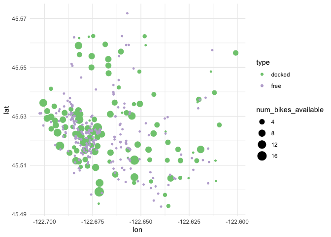

# General Bikeshare Feed Specification - R Package

*Developed by Kaelyn M. Rosenberg (author) and Simon P. Couch (author,
maintainer)*

 [](https://travis-ci.org/ds-civic-data/gbfs)


The `gbfs` package supplies a set of functions to interface with General
Bikeshare Feed Specification .json feeds in R, allowing users to save
and accumulate tidy .rds datasets for specified cities/bikeshare
programs. The North American Bikeshare Association’s
[gbfs](https://github.com/NABSA/gbfs) is a standardized data release
format for live information on the status of bikeshare programs, as well
as metadata, including counts of bikes at stations, ridership costs, and
geographic locations of stations and parked bikes.

**Features**

  - Get bikeshare data by specifying city or supplying url of feed
  - All feeds for a city can be saved with a single function
  - New information from dynamic feeds can be appended to existing
    datasets

## Installation

We’re now on CRAN\! Install the latest release, 1.2.0, with:

``` r
install.packages("gbfs")
library(gbfs)
```

You can install the development version of `gbfs` from github with:

``` r
# install.packages("devtools")
devtools::install_github("ds-civic-data/gbfs")
```

## Background

The `gbfs` is a standardized data feed describing the current status of
a bikeshare program.

Although all of the data is live, only a few of the datasets change
often:

  - `station_status`: Supplies the number of available bikes and docks
    at each station as well as station availability
  - `free_bike_status`: Gives the coordinates and metadata on available
    bikes that are parked, but not at a station.

In this package, these two datasets are considered “dynamic”, and can be
specified as desired datasets by setting `feeds = "dynamic"` in the main
wrapper function in the package, `get_gbfs`.

Much of the data supplied in this specification can be considered
static. If you want to grab all of these for a given city, set `feeds =
"static'` when calling `get_gbfs`. Static feeds include:

  - `system_information`: Basic metadata about the bikeshare program
  - `station_information`: Information on the capacity and coordinates
    of stations
  - Several optional feeds: `system_hours`, `system_calendar`,
    `system_regions`, `system_pricing_plans`, and `system_alerts`

Each of the above feeds can be queried with the `get_suffix` function,
where `suffix` is replaced with the name of the relevant feed.

For more details on the official `gbfs` spec, see [this
document](https://github.com/NABSA/gbfs/blob/master/gbfs.md).

## Example

In this example, we’ll grab data from Portland, Oregon’s Biketown
bikeshare program and visualize some of the different datasets.

``` r
# load necessary packages
library(tidyverse)
```

First, we’ll grab some information on the stations.

``` r
# grab portland station information and return it as a dataframe
pdx_station_info <- get_station_information("portland", output = "return")
```

…as well as the number of bikes at each station.

``` r
# grab current capacity at each station and return it as a dataframe
pdx_station_status <- get_station_status("portland", output = "return")
```

Joining these datasets, we can get the capacity at each station, along
with each station’s metadata.

``` r
# full join these two datasets on station_id and select a few columns
pdx_stations <- full_join(pdx_station_info, 
                          pdx_station_status, 
                          by = "station_id") %>%
  # just select columns we're interested in visualizing
  select(id = station_id, 
         lon, 
         lat, 
         num_bikes_available, 
         num_docks_available) %>%
  mutate(type = "docked")
```

Finally, before we plot, lets grab the locations of the bikes parked in
Portland that are not docked at a station,

``` r
# grab data on free bike status and save it as a dataframe
pdx_free_bikes <- get_free_bike_status("portland", output = "return") %>%
  # just select columns we're interested in visualizing
  select(id = bike_id, lon, lat) %>%
  # make columns analogous to station_status for row binding
  mutate(num_bikes_available = 1,
         num_docks_available = NA,
         type = "free")
```

…and bind these dataframes together\!

``` r
# row bind stationed and free bike info
pdx_full <- bind_rows(pdx_stations, pdx_free_bikes)
```

Now, plotting,

``` r
# filter out stations with 0 available bikes
pdx_full %>%
  filter(num_bikes_available > 0) %>%
  # plot the geospatial distribution of bike counts
  ggplot() + 
  aes(x = lon, 
      y = lat, 
      size = num_bikes_available, 
      col = type) +
  geom_point() +
  # make aesthetics slightly more cozy
  theme_minimal() +
  scale_color_brewer(type = "qual")
```

<!-- -->

Folks who have spent a significant amount of time in Portland might be
able to pick out the Willamette River running Northwest/Southeast
through the city. With a few lines of `gbfs`, `dplyr`, and `ggplot2`, we
can pick together a meaningful visualization to help us better
understand how bikeshare bikes are distributed throughout Portland.

Some other features worth playing around with in `gbfs` that weren’t
touched on in this example:

  - The main wrapper function in the package, `get_gbfs`, will grab
    every dataset for a given city. (We call the functions to grab
    individual datasets above for clarity.)
  - We set `output = "return"` in all of the above calls—if you leave
    the output argument as default and supply a directory, `gbfs` will
    save the dataframes in your local files.  
  - When the `output` argument is left as default in
    `get_free_bike_status` and `get_station_status` (the functions for
    the `dynamic` dataframes,) and a dataframe already exists at the
    given path, `gbfs` will row bind the dataframes, allowing for the
    capability to accumulate large datasets over time.
